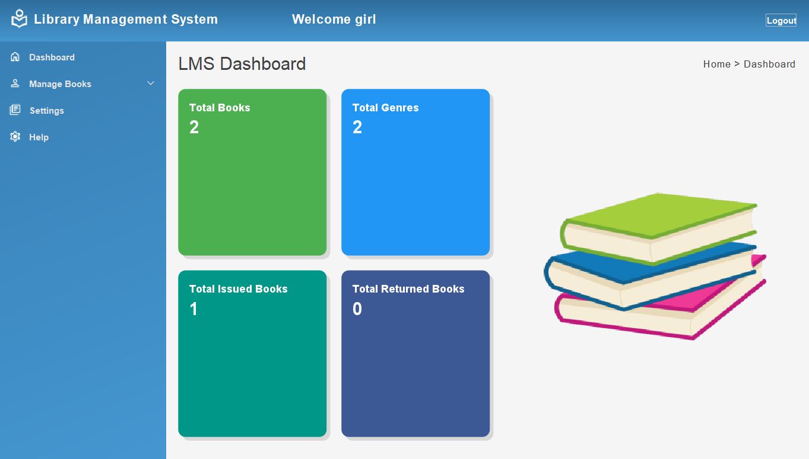

# StackTrack - A Library Management System
<!--Badges: License Badge-->

StackTrack is  a Library Management System designed to streamline the process of managing library users and books.

 It enables administrators/librarians to efficiently track and manage book circulation, user accounts, and overall library operations.

In additon to operations catered towards adminsitrators/libarains, StackTrack includes the ability for library patrons to manage and view their account information.

## Built With

## Features
<!--List the main features or functionalities of project-->
- Librarian/Admin Features
    - Manage Users
        - Add Users
        - View Users
    - Manage Books
        - Add Books
        - View Books
        - Issue Books
        - View Issued Books
        - Return Books
        - View Returned Books
- User Features
    - Manage Books
        - View Books
        - View Issued Books
        - View Returned Books

## Sceenshots
<!--Photos of App: Login, Signup, Librarian Frame, LibarianFrame, UserFrame, Add User, Manage Users, Add Book, Manage Books-->
### Login

### Signup

### Librarian/Admin Frame

#### View Books

#### Add Books

#### View Users

#### Add Users

### User Frame

#### View Issued Books

# Project Roadmap

What's Been Completed:

- Ability for Admin to add database entries for "books", "issued_books", "returned books", and "users"
- Ability for Admin to view database entries for "books", "issued_books", "returned books" and "users"
- Ability for User to view database entries for "books", "issued_books" (related to their UID), and "returned books" (related to their UID)
 
Potential Add-ons:

- Ability for Admin to edit database entries for "books", "issued_books", "returned books", and "users"
- Ability for Admin to delete database entries for "books", "issued_books", "returned books", and "users"
- Ability for Admin and User to change color scheme of application

# License

Distributed under the GNU GPLv3 License. See the "COPYING" file for more information.
